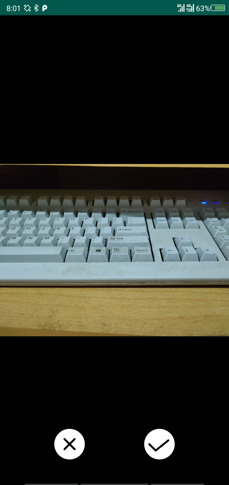

## 浙江大学安卓开发小学期 作业8

> 姓名：朱璟森
>
> 学号：3170104166
>
> 专业：计算机科学与技术

****

### 完成内容

* TODO中的基本要求，实现调用系统相机进行照片拍摄、视频录制并在指定`ImageView`, `VideoView`中预览

* TODO中的基本要求，实现自定义相机进行照片拍摄、视频录制，以及相机镜头画面实时显示

* 修复自定义相机`CustomCameraAcitivity`的一个BUG：原版打开自定义相机按HOME键返回桌面再重进应用后相机画面会黑屏。通过重写`OnStart`, `OnStop`方法将相机资源即时申请、释放，修复了这个BUG

* 自定义相机拍摄的照片、视频可以在系统相册中找到：通过`MediaScannerConnection.scanFile`方法扫描相册

* 在自定义相机中增加前后置摄像头转换 ("FACE"按钮)、自动对焦 ("ZOOM"按钮)

* 自定义相机拍摄照片、视频后会进入预览页面，用户可以在预览页面中选择保留照片/视频 ("√"按钮) 或删除照片/视频 ("×"按钮)，如下图：

  